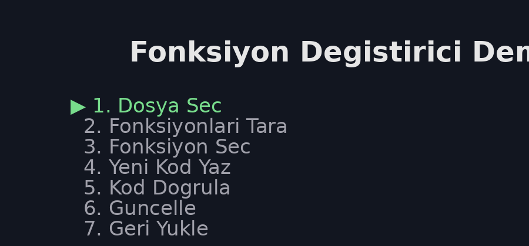

  

<h1 align="center">Fonksiyon Değiştirici</h1>

Python fonksiyonlarını güvenli biçimde tarayan, düzenleyen, güncelleyen ve yedekten geri yükleyen modüler Kivy aracı

---

<b>Seç • Tara • Düzenle • Doğrula • Güncelle • Geri Yükle</b>

---

# Demo

  

---

# İçindekiler

- [Genel Bakış](docs/overview.md)
- [Kullanım Rehberi](docs/usage.md)
- [Mimari](docs/architecture.md)
- [Güvenlik](docs/security.md)

---

# Proje Özeti

Fonksiyon Değiştirici, Python dosyalarındaki fonksiyonları tarayan,  
seçilen fonksiyonu düzenlemeye izin veren ve değişiklikleri güvenli  
biçimde uygulayan modüler bir araçtır.

Tam bir IDE değildir.

Bunun yerine:

- fonksiyon bazlı düzenleme
- güvenli güncelleme
- otomatik yedek
- geri yükleme

akışı sunar.

---

# Kurulum

pip install kivy pygments

---

# Çalıştırma

python main.py

---

# Repo Yapısı

app  
├─ core  
├─ services  
└─ ui  

docs  
├─ overview.md  
├─ usage.md  
├─ architecture.md  
└─ security.md  

---

# Lisans

Bu proje MIT lisansı altında dağıtılmaktadır.
